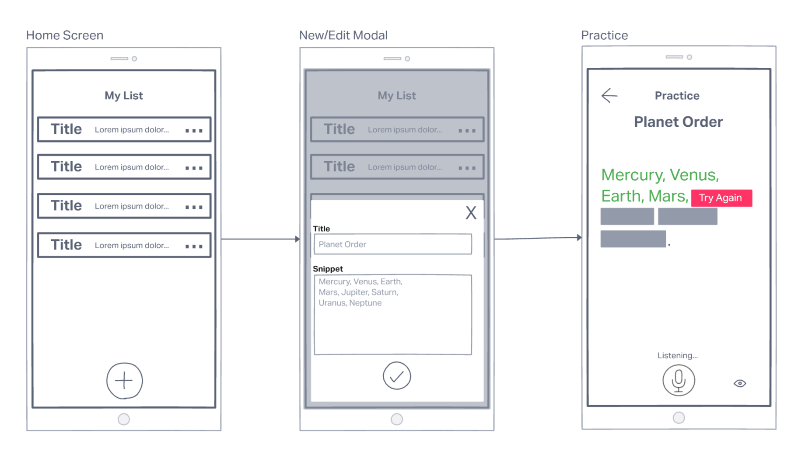
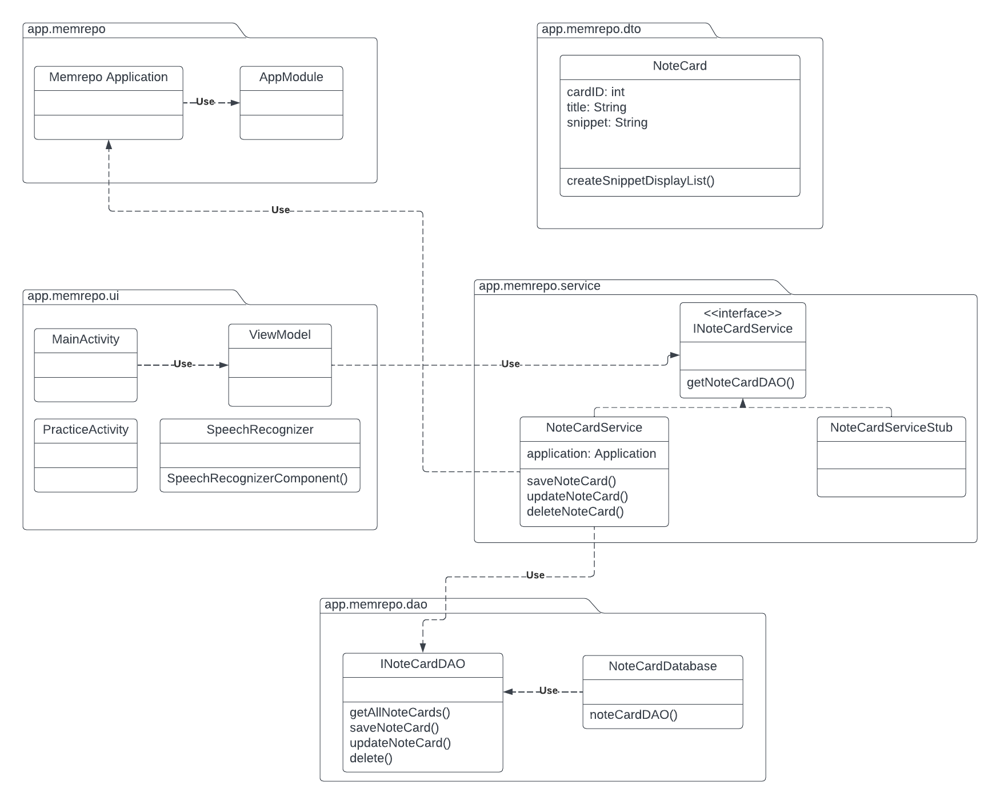

# MemRepo

## Introduction
Do you need to study and hate using flash cards? Do you need to memorize your line for a play?  
MemRepo can help with that:  
- Create and store multiple memory snippets  
- Enter the text you want to memorize/study  
- Use your voice to test yourself  
- See exactly where you're having problems  

MemRepo can help you practice and memorize:  
- Scriptures
- Science Facts
- Poetry
- Documents
- Speeches
- Math
- Quotes
- History and Geography

## Storyboard

## Functional Requirements

## Requirement 100.0: Practice Memory Snippit

### SCENARIO
As a user interested in memorizing snippets, I want to be able to practice the snippets I wrote, using the microphone,  
so that I can see feedback on how accurately I can recite this snippet.

### DEPENDENCIES
User written snippets are available and accessible.  
The user has enabled speech recognition settings.

### ASSUMPTIONS
The snippet text matches with the user’s default language. 

### EXAMPLES
#### 1.1
**Given** a memory snippet is available  
**When** I click the more options button and click practice  
**Then** I should be taken to the practice screen

#### 1.2
**Given** a memory snippet is available and user is on practice screen  
**When** I click the microphone button  
**Then** the text above the microphone should change to listening and capture my voice as I speak

#### 1.3
**Given** a memory snippet is available and user is on practice screen  
**When** I click microphone and don’t speak  
**Then** I should receive and error message:  
Error could not recognize voice

#### 1.4 
**Given** the order of the planets’ memory snippet is available  
**Given** the microphone is active  
**When** I speak the order: Mercury, Venus, Earth, Mars, Jupiter, Saturn, Uranus, Neptune  
**Then** all of my answer’s snippet text should appear green.

#### 1.5 
**Given** the order of the planets’ memory snippet is available  
**Given** the microphone is active  
**When** I speak the order: Mercury, Venus, Mars, Earth, Jupiter, Saturn, Uranus, Neptune  
**Then** the answer text of Mercury, Venus, Jupiter, Saturn, Uranus, and Neptune  
should appear green, and the answer text of Earth and Mars should appear red. 

#### 1.6
**Given** the order of the planets’ memory snippet is available  
**Given** the microphone is active  
**When** I speak the order: Earth, Mercury, Venus, Uranus, Neptune, Mars, Jupiter, Saturn  
**Then** all of my answer’s text should appear red. 

## Requirement 101.0: Modify Memory Snippet

### SCENARIO
As a user interested in memory snippets, I want to make modifications so that i can create, modify, and delete snippets

### DEPENDENCIES
Memory snippet data is available and accessible. 

### ASSUMPTIONS
The snippet text matches user’s default language.

### Examples
#### 1.1  
**Given** the option to add snippets is available  
**When** I click on the add button  
**Then** I should see a popup to show me a snippet creation form. 

#### 1.2 
**Given** the planet order memory snippet is available  
**When** I click on the more options button  
**Then** I should see an option to edit, delete, or practice the notecard. 

#### 1.3  
**Given** the planet order memory snippet is available  
**When**:  
- I click on the more options button 
- I click the edit option  
**Then** I should see a popup with an editable snippet form.

#### 1.4  
**Given** the planet order memory snippet is available   
**When**:  
- I click on the more options button 
- I click the delete option  
**Then** the notecard should be removed from my list of notecards. 

#### 1.5  
**Given** the option to add snippets is available  
**When**:  
- I fill out a snippet creation form for the order of Earth’s layers 
- I hit the save button  
**Then** when I navigate to my notecards, I should see the notecard “Earth’s Layers”. 

#### 1.6 
**Given** the Earth’s layers memory snippet is available  
**When**:  
- I edit the Earth’s layers’ notecard 
- I hit the save button  
**Then** when I navigate to the Earth’s layers’ notecard, I should see the saved changes I made. 

## Class Diagram

## Class Diagram Description

**MemrepoApplication**: Koin dependency injection is used. Uses the app modules which specifies what viewModel to use. 

**MainActivity**: The main screen that the user sees when entering the app. Allows user to create, delete, and update a memory snippet. 

**PracticeActivity**: The second screen that the user sees when entering the practice mode. User uses microphone to practice the particular memory snippet they selected. 

**SpeechRecognizer**: Component class that uses the [SpeechReconizer](https://developer.android.com/reference/android/speech/SpeechRecognizer) class. 

**Notecard**: Object class that represents all data for a specific memory snippet for a user. Includes title for question, description for memory snippet, and an ID to accurately track in the database. 

**INoteCardService**: Interface for the INoteCardService to fetch the NoteCardDAO. 

**NoteCardDatabase**: Uses Room database to store user made memory snippets locally on device. The NoteCardService uses the NoteCardDAO to make CRUD operation calls to the database.

## Responsibilities

### Roles

Product Owner / Scrum Master / Developer - Aj White 
Frontend Developer - Javohir Jalolitdinov 
Integration Developer / PM Support - Nicholas Lawson 
Developer Support - Pruthvi Patel 
Developer Support - Ravi Patel 
Developer Support - Monil Patel 

### Weekly Meetings

Standups: Mondays 11:00am - 11:15am | Thursdays 9:30am - 9:40am 
Development Work-Time: Tuesdays 11:00am-12:00pm | Thursdays 12:30pm - 1:30pm
